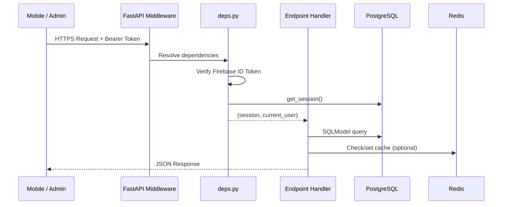
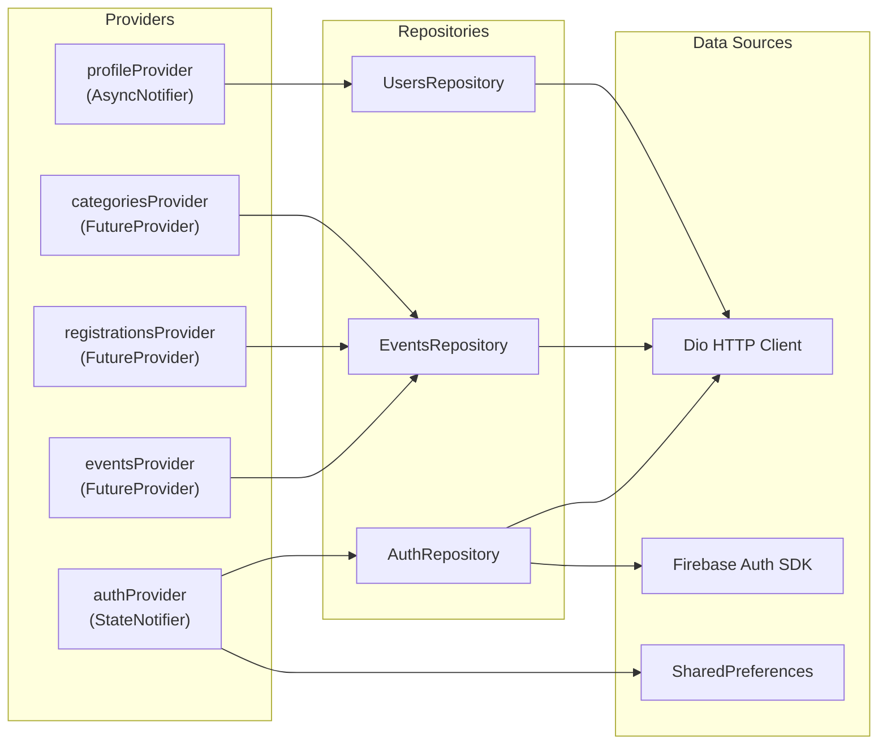
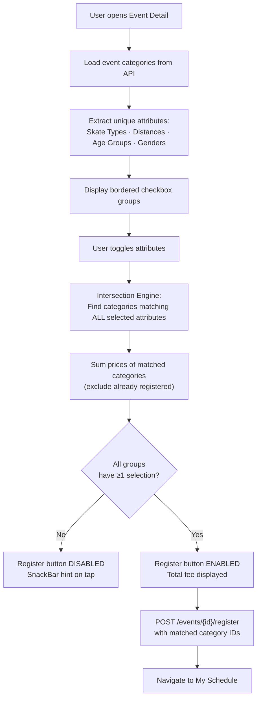
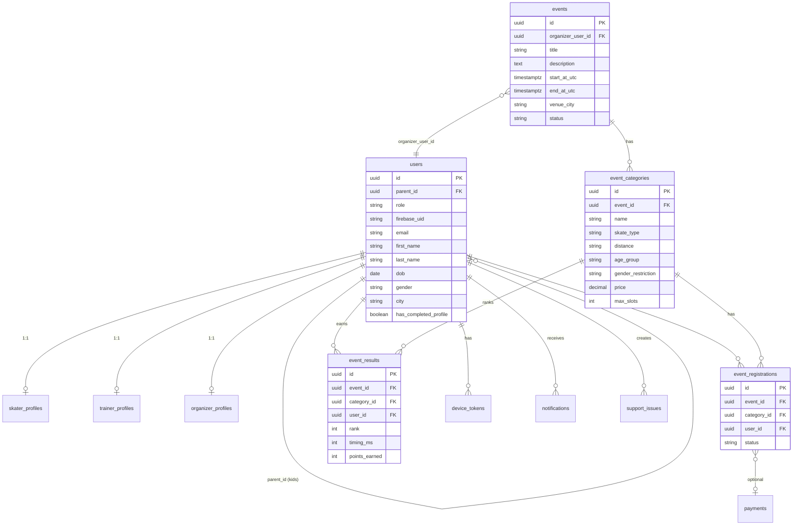
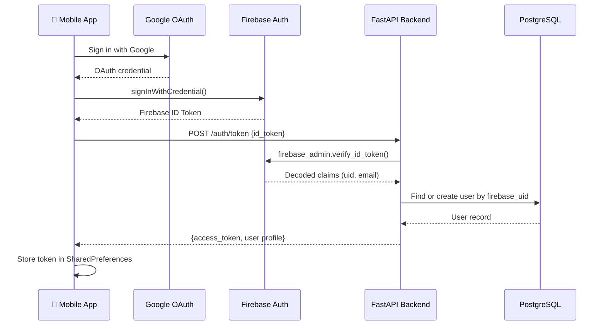
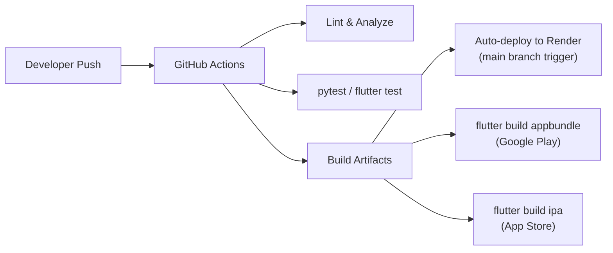

# ZestS — Architecture & Project Documentation

> **Production-Grade Sports Event Management Platform**
> Version: 1.0.0 · Last updated: April 2026

---

## 1. Project Overview

ZestS is a vertically integrated platform for managing competitive skating events. It covers the full lifecycle — from event creation by organizers, to registration by parents/skaters, to result publishing and leaderboards. The system is built as a **monorepo** with three independently deployable components:

| Component | Stack | Path |
|-----------|-------|------|
| **Mobile App** | Flutter (Dart) | `/mobile` |
| **Backend API** | FastAPI (Python) | `/backend` |
| **Admin Dashboard** | Next.js (TypeScript) | `/admin` |

### Target Users & Roles

| Role | Description |
|------|-------------|
| **Skater** | Registers for events, views results and leaderboards |
| **Parent** | Manages kid sub-profiles, registers children for events |
| **Trainer** | Affiliated with clubs/schools, associated with skaters |
| **Organizer** | Creates and manages events, publishes results |
| **Admin** | Full platform control — users, events, banners, sponsors, config |
| **Guest** | Unauthenticated user; can browse limited event previews |

---

## 2. High-Level System Architecture

```mermaid
graph TB
    subgraph Clients
        MOBILE["📱 Flutter Mobile App<br/>(iOS & Android)"]
        ADMIN["🖥️ Next.js Admin Dashboard"]
    end

    subgraph Cloud Services
        FIREBASE["🔥 Firebase<br/>Auth · FCM · Remote Config · Analytics"]
        GCS["☁️ GCP Cloud Storage<br/>Image Uploads"]
    end

    subgraph Render Cluster — Singapore
        API["⚡ FastAPI Backend<br/>uvicorn · Python 3.12"]
        CELERY["⚙️ Celery Worker<br/>Background Tasks"]
        REDIS["🔴 Redis 7<br/>Cache · Session · Broker"]
        MEILI["🔍 Meilisearch v1.10<br/>Full-Text Search"]
    end

    subgraph Supabase — Cloud
        PG["🐘 PostgreSQL 16<br/>Primary Database"]
    end

    MOBILE -->|HTTPS REST| API
    ADMIN -->|HTTPS REST| API
    MOBILE -->|Auth Tokens| FIREBASE
    API -->|Verify ID Tokens| FIREBASE
    API -->|Push Notifications| FIREBASE
    API -->|Image Upload| GCS
    API -->|SQL Queries| PG
    API -->|Cache / Pub-Sub| REDIS
    API -->|Index Sync| MEILI
    REDIS -->|Task Broker| CELERY
    CELERY -->|SQL Queries| PG
    CELERY -->|Send FCM| FIREBASE
```

---

## 3. Backend Architecture (FastAPI)

### 3.1 Directory Layout

```
backend/
├── app/
│   ├── main.py                 # FastAPI app factory, middleware, startup hooks
│   ├── api/
│   │   ├── deps.py             # Dependency injection (auth, DB session)
│   │   └── v1/
│   │       ├── router.py       # Aggregate router mounting
│   │       └── endpoints/
│   │           ├── admin.py    # Admin CRUD (users, events, banners, sponsors)
│   │           ├── auth.py     # Firebase token exchange
│   │           ├── config.py   # Remote config / feature flags
│   │           ├── content.py  # Banners, sponsors, static pages, tips
│   │           ├── events.py   # Event CRUD, categories, registrations, results
│   │           ├── notifications.py  # FCM token management, push triggers
│   │           ├── search.py   # Meilisearch event search
│   │           ├── uploads.py  # GCP Storage file upload
│   │           └── users.py    # Profile CRUD, kid management
│   ├── core/                   # Settings, security, config
│   ├── db/                     # SQLModel engine, session factory, startup patches
│   ├── models/                 # SQLModel table definitions
│   │   ├── user.py             # User, SkaterProfile, TrainerProfile, etc.
│   │   ├── event.py            # Event, EventCategory, EventRegistration, EventResult
│   │   ├── content.py          # Banner, Sponsor, StaticPage, TipOfDay
│   │   ├── notification.py     # DeviceToken, Notification
│   │   ├── audit.py            # AuditLog
│   │   └── enums.py            # Shared enumerations
│   ├── schemas/                # Pydantic request/response schemas
│   ├── services/               # Business logic layer
│   │   ├── firebase_auth.py    # Firebase Admin SDK token verification
│   │   ├── notifications.py    # FCM push dispatch
│   │   ├── search.py           # Meilisearch client
│   │   ├── search_sync.py      # Celery-triggered index sync
│   │   ├── seeder.py           # E2E data seeder (multi-transaction)
│   │   ├── storage.py          # GCP Cloud Storage uploads
│   │   └── mailer.py           # Email service (future)
│   └── workers/                # Celery app and task definitions
├── alembic/                    # Database migrations
├── tests/                      # Pytest test suite
├── requirements.txt            # Python dependencies
└── Dockerfile                  # Container image
```

### 3.2 Request Lifecycle



### 3.3 Key Python Dependencies

| Package | Version | Purpose |
|---------|---------|---------|
| `fastapi` | 0.116.0 | Web framework |
| `uvicorn` | 0.35.0 | ASGI server |
| `sqlmodel` | 0.0.24 | ORM (SQLAlchemy + Pydantic) |
| `psycopg` | 3.2.13 | PostgreSQL driver |
| `alembic` | 1.16.4 | Schema migrations |
| `redis` | 5.2.1 | Cache & session |
| `celery` | 5.5.3 | Background task queue |
| `firebase-admin` | 6.9.0 | Auth verification & FCM |
| `google-cloud-storage` | 2.19.0 | Image uploads |
| `meilisearch` | 0.34.0 | Full-text search |
| `httpx` | 0.28.1 | Async HTTP client |

---

## 4. Mobile Architecture (Flutter)

### 4.1 Directory Layout

```
mobile/lib/
├── main.dart                   # Entry point, Firebase init
├── firebase_options.dart       # Generated Firebase config
├── app/
│   ├── app.dart                # MaterialApp + ProviderScope
│   ├── app_startup.dart        # Splash + initialization logic
│   ├── router/                 # GoRouter configuration
│   └── theme/                  # App theme (colors, typography)
├── core/
│   ├── api_client.dart         # Dio HTTP client with interceptors
│   ├── api_exception_handler.dart
│   ├── constants.dart          # API base URL, feature flags
│   ├── notification_service.dart  # FCM setup & handling
│   ├── permission_service.dart
│   ├── remote_config_service.dart # Firebase Remote Config
│   └── storage.dart            # SharedPreferences wrapper
├── features/
│   ├── auth/                   # Login (Google/Phone), token exchange
│   ├── home/                   # Home screen, banners, events list
│   ├── events/                 # Event detail, registration, results
│   ├── profile/                # User profile, kid management
│   ├── admin/                  # Admin-specific screens
│   ├── onboarding/             # First-launch tutorial
│   ├── settings/               # App settings
│   └── support/                # Support ticket submission
└── shared/
    └── widgets/                # Reusable UI components
```

### 4.2 State Management — Riverpod



### 4.3 Key Flutter Dependencies

| Package | Purpose |
|---------|---------|
| `flutter_riverpod` | State management |
| `go_router` | Declarative routing with deep links |
| `dio` | HTTP client with interceptors |
| `firebase_core/auth/messaging` | Authentication & push notifications |
| `firebase_remote_config` | Feature flags |
| `google_sign_in` | Google OAuth |
| `cached_network_image` | Image caching |
| `skeletonizer` | Skeleton loading animations |
| `app_links` | Deep link handling |
| `share_plus` | Native share sheet |
| `url_launcher` | External URL handling |
| `image_picker` | Profile photo upload |

### 4.4 Grouped Event Registration Flow

This is the core UX innovation — replacing a flat category list with grouped attribute selection:



---

## 5. Database Schema (Entity Relationships)



### Key Database Tables

| Table | Description |
|-------|-------------|
| `users` | All accounts (parents, kids, skaters, trainers, organizers, admins) |
| `skater_profiles` | Extended fields for skaters (skill level, years, tracks) |
| `trainer_profiles` | Extended fields for trainers (club, specialization) |
| `organizer_profiles` | Extended fields for organizers (org name, website) |
| `events` | Skating events with status lifecycle (draft → published → completed) |
| `event_categories` | Category combinations within events (skate_type × distance × age × gender) |
| `event_registrations` | User sign-ups linked to specific categories |
| `event_results` | Competition rankings and points |
| `payments` | Payment records (Razorpay/Stripe integration ready) |
| `banners` | Promotional content and ZestS logo (unified banner system) |
| `sponsors` | Event sponsor information |
| `static_pages` | CMS content (Terms, About, Privacy) |
| `device_tokens` | FCM push notification tokens |
| `notifications` | In-app notification records |
| `support_issues` | User support tickets |
| `audit_logs` | Admin action audit trail |
| `tip_of_day` | Daily tips shown on home screen |
| `referrals` | Referral tracking between users |

---

## 6. Authentication Flow



### Auth Design Decisions
- **Firebase as IdP**: Google and Phone OTP sign-in handled entirely by Firebase client SDK.
- **Backend validates only**: The FastAPI backend never stores passwords; it verifies Firebase ID tokens via the Admin SDK.
- **Token exchange**: The mobile app sends the Firebase ID token to `/auth/token`, which returns a session token for subsequent API calls.
- **Role-based guards**: Endpoints check `current_user.role` via dependency injection (`deps.py`).
- **Auth toggle**: Authentication can be disabled via `AUTH_ENABLED=false` for local development.

---

## 7. Infrastructure & Deployment

### 7.1 Production Stack (Render — Singapore Region)

| Service | Type | Runtime / Provider | Purpose |
|---------|------|---------|---------|
| `zests-backend` | Web Service | Python 3.12 (Render) | FastAPI API server |
| `zests-admin` | Web Service | Node.js (Render) | Next.js admin panel |
| `zests-celery-worker` | Worker | Python 3.12 (Render) | Background tasks (FCM, search sync) |
| PostgreSQL | Database | Supabase (v16) | Primary relational store (Migrated from Render) |
| Redis | Key-Value | v7 (Render) | Cache, sessions, Celery broker |

### 7.2 Local Development Stack (Docker Compose)

```yaml
services:
  postgres:   # PostgreSQL 16 on port 5432
  redis:      # Redis 7 on port 6379
  meilisearch: # Meilisearch v1.10 on port 7700
```

### 7.3 CI/CD Pipeline



---

## 8. Cost Analysis

### 8.1 Current Monthly Costs (MVP / Early Stage)

| Service | Provider | Tier | Monthly Cost |
|---------|----------|------|-------------|
| Backend + Admin Hosting | Render | Free / Starter | **$0 – $14** |
| PostgreSQL | Render | Free (90-day) / Starter | **$0 – $7** |
| Redis | Render | Free (25MB) | **$0** |
| Firebase Auth | Google | Free tier (50K MAU) | **$0** |
| Firebase Cloud Messaging | Google | Free (unlimited) | **$0** |
| Firebase Remote Config | Google | Free | **$0** |
| Firebase Analytics | Google | Free | **$0** |
| GCP Cloud Storage | Google | Free tier (5GB) | **$0** |
| Meilisearch | Self-hosted on Render | Included in backend | **$0** |
| Domain + SSL | Render | Included | **$0** |
| **Total (MVP)** | | | **$0 – $21/mo** |

### 8.2 Growth Projections

| Scale | Users | Events/mo | DB Size | Est. Monthly Cost |
|-------|-------|-----------|---------|-------------------|
| **Launch** | 0–500 | 5–10 | < 500 MB | **$0 – $21** |
| **Traction** | 500–5,000 | 20–50 | 1–5 GB | **$40 – $80** |
| **Growth** | 5,000–25,000 | 50–200 | 5–20 GB | **$100 – $250** |
| **Scale** | 25,000–100,000 | 200+ | 20–100 GB | **$300 – $800** |

### 8.3 Cost Drivers at Scale

| Factor | Free Tier Limit | What Triggers Paid |
|--------|----------------|-------------------|
| **Render Compute** | 750 hrs/mo (free tier spins down) | Always-on requires Starter ($7/svc) |
| **Render PostgreSQL** | 1 GB, 90-day expiry | Persistent DB requires Starter ($7/mo) |
| **Render Redis** | 25 MB | Heavy caching exceeds free tier |
| **Firebase Auth** | 50,000 MAU free | Phone OTP costs $0.06/verification beyond free |
| **GCP Storage** | 5 GB free | Event banners + profile photos growth |
| **FCM Push** | Unlimited | No cost driver |
| **Meilisearch** | Self-hosted (free) | Meilisearch Cloud if outsourced (~$30/mo) |

### 8.4 Cost Optimization Strategies

1. **Render free tier** covers the MVP phase entirely
2. **Firebase free tier** is generous — 50K MAU is sufficient for years
3. **Image optimization**: Compress uploads before storing in GCS
4. **Database indexing**: Proper indexes prevent expensive query costs
5. **Redis TTL**: Short cache TTLs prevent memory bloat
6. **Future**: Consider migrating to **Railway**, **Fly.io**, or **self-hosted VPS** ($5–10/mo) once Render free tier expires

---

## 9. Security Architecture

| Layer | Implementation |
|-------|---------------|
| **Authentication** | Firebase ID token verification via Admin SDK |
| **Authorization** | Role-based guards in `deps.py` (`admin`, `organizer`) |
| **Transport** | HTTPS enforced on all Render services |
| **Secrets** | Environment variables only; never committed to Git |
| **Input Validation** | Pydantic schemas validate all request bodies |
| **SQL Injection** | SQLModel parameterized queries |
| **CORS** | Configured in FastAPI middleware |
| **Audit Trail** | `audit_logs` table tracks admin actions |
| **Soft Deletion** | `deleted_users` table preserves historical data |

---

## 10. Key Features & Technical Highlights

### Deep Link Sharing
- Uses `app_links` for native handling of `https://zests.app/events/{id}` URLs
- Banners and events share deep links that route into the app or redirect to app stores

### Unified Banner System
- The ZestS logo is stored as a standard entry in the `banners` table
- All promotional content (logo, ads, announcements) uses a single rendering pipeline

### Grouped Event Registration (Intersection Logic)
- Categories are decomposed into 4 attribute dimensions: **Skate Type**, **Distance**, **Age Group**, **Gender**
- Users select attributes via grouped checkboxes
- The system computes matching categories via set intersection
- Registration only activates when all groups have ≥1 selection
- Prices are summed dynamically across all matched categories

### Parent-Child Profiles
- Parents have `parent_id = null`; kids have `parent_id = parent.id`
- Parents can register their children for events via a dropdown selector
- Maximum kids per parent is configurable (`MAX_KIDS_PER_PARENT`)

---

## 11. API Contract Summary

| Endpoint | Method | Description |
|----------|--------|-------------|
| `/healthz` | GET | Health check |
| `/api/v1/auth/token` | POST | Firebase token exchange |
| `/api/v1/users/me` | GET | Current user profile |
| `/api/v1/users/me/kids` | POST | Add kid sub-profile |
| `/api/v1/events/upcoming` | GET | Published events list |
| `/api/v1/events/upcoming/anonymous` | GET | Limited preview for guests |
| `/api/v1/events/{id}` | GET | Event detail |
| `/api/v1/events/{id}/categories` | GET | Event categories |
| `/api/v1/events/{id}/register` | POST | Register for categories |
| `/api/v1/events/{id}/status` | POST | Publish/cancel event |
| `/api/v1/events/{id}/results` | GET/POST | Leaderboard results |
| `/api/v1/content/banners` | GET | Active banners |
| `/api/v1/content/sponsors` | GET | Sponsors list |
| `/api/v1/pages/{slug}` | GET | Static CMS pages |
| `/api/v1/search/events` | GET | Full-text event search |
| `/api/v1/notifications/token` | POST | Register FCM token |
| `/api/v1/uploads/image` | POST | Upload image to GCS |
| `/api/v1/admin/*` | CRUD | Admin management endpoints |

---

## 12. AI-Assisted Development Prompt

> Use this prompt as a starting template when building a similar project from scratch using an AI coding assistant.

---

```
SYSTEM ROLE: You are a Senior Full-Stack Developer specializing in mobile-first
SaaS applications. You will build a production-grade platform using the
following architecture.

PROJECT: [Your Project Name] — [One-line description]

TECH STACK:
- Mobile: Flutter (Dart) with Riverpod for state management, GoRouter for
  navigation, Dio for HTTP, Firebase for auth/push/analytics
- Backend: Python FastAPI with SQLModel ORM, PostgreSQL, Redis, Celery
- Admin: Next.js (TypeScript) web dashboard
- Infrastructure: Docker Compose (local), Render.com (production)
- Auth: Firebase Authentication (Google + Phone OTP)
- Storage: GCP Cloud Storage for images
- Search: Meilisearch for full-text search

ARCHITECTURE PRINCIPLES:
1. Monorepo with three deployable components: /mobile, /backend, /admin
2. Feature-based folder structure in mobile: features/{name}/data|presentation
3. Backend follows: api/endpoints → services → models → db layers
4. All database models use UUID primary keys and TIMESTAMPTZ for dates
5. Role-based access control: define roles and guard endpoints accordingly
6. Firebase as the sole identity provider — backend only verifies tokens
7. Pydantic schemas for request/response validation on every endpoint
8. Alembic for database migrations (never raw ALTER TABLE)
9. Environment variables for ALL secrets — never commit to git
10. Celery + Redis for background tasks (notifications, search sync)

MOBILE PATTERNS:
- AsyncNotifier/FutureProvider for async state in Riverpod
- Repository pattern: Provider → Repository → Dio → API
- Skeleton loaders (skeletonizer) during async data fetching
- Deep link handling via app_links package
- Native splash screen via flutter_native_splash
- Cached images via cached_network_image
- UI: Material Design 3 with bordered containers for grouped selections

BACKEND PATTERNS:
- Dependency injection via FastAPI Depends() for auth and DB sessions
- SQLModel for unified ORM + Pydantic models
- Service layer for complex business logic (keep endpoints thin)
- Startup hooks for DB table creation and schema patching
- Background workers for push notifications and search index sync

DATABASE DESIGN APPROACH:
- Core entities: Users (with role-based profiles), Events, Categories,
  Registrations, Results, Payments
- Parent-child relationships via self-referencing FK on users table
- Event categories carry metadata (type, distance, age, gender, price)
- Soft deletion with archival table for users (preserve FK integrity)

DEPLOYMENT:
- Local: docker-compose up (postgres, redis, meilisearch)
- Production: Render.com with render.yaml blueprint
- CI/CD: GitHub Actions for lint, test, build on every push
- Mobile: flutter build appbundle (Android) / flutter build ipa (iOS)

COST OPTIMIZATION:
- Start on free tiers (Render free, Firebase free 50K MAU)
- Plan for Render Starter ($7/service) when going always-on
- Firebase Phone OTP costs $0.06/SMS beyond free tier
- Compress images before upload, set Redis TTLs, index DB queries

FIRST STEPS:
1. Initialize monorepo with /mobile, /backend, /admin directories
2. Set up docker-compose.yml with postgres, redis, meilisearch
3. Create backend FastAPI app with health check endpoint
4. Define SQLModel database models and create tables
5. Implement Firebase auth token exchange endpoint
6. Create Flutter app with Riverpod, GoRouter, and login flow
7. Build event CRUD API endpoints
8. Build mobile event listing and detail screens
9. Add event registration with grouped category selection
10. Set up admin dashboard with user and event management
11. Configure Render deployment with render.yaml
12. Add push notifications via Firebase Cloud Messaging
```

---

## 13. Repository Structure Summary

```
ZestS-repo/
├── .github/workflows/          # CI/CD pipelines
├── admin/                      # Next.js admin dashboard
│   └── src/
├── backend/                    # FastAPI backend
│   ├── app/
│   │   ├── api/v1/endpoints/   # 9 endpoint modules
│   │   ├── core/               # Config, security
│   │   ├── db/                 # Engine, session, patches
│   │   ├── models/             # 6 model modules
│   │   ├── schemas/            # Pydantic schemas
│   │   ├── services/           # 7 service modules
│   │   └── workers/            # Celery tasks
│   ├── alembic/                # Migrations
│   └── tests/                  # Pytest suite
├── docs/                       # Documentation
├── infra/                      # IaC (render.yaml, GCR configs)
├── mobile/                     # Flutter mobile app
│   └── lib/
│       ├── app/                # App shell, router, theme
│       ├── core/               # API client, constants, services
│       ├── features/           # 8 feature modules
│       └── shared/             # Reusable widgets
├── scripts/                    # 23 utility scripts
├── static/                     # Static assets
├── docker-compose.yml          # Local dev infrastructure
├── db_design_final.md          # Database schema reference
├── db_design_updated_24Mar.md  # Synchronized schema with SQLModels
└── README.md                   # Project overview & setup guide
```
